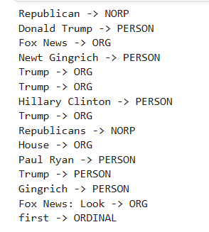

# 📰 Fake News Detection using NLP

This project was developed as part of my one-month NLP internship at **Elevvo**.  
It demonstrates binary text classification, NLP preprocessing, feature engineering, and machine learning techniques to detect fake news articles.

---

## 📝 Project Overview

- **Dataset:** Fake & Real News Dataset (Kaggle)
- **Problem Type:** Binary Text Classification
- **Goal:** Classify news articles as **Fake** or **Real**

---

## 🔎 Project Pipeline

### 1️⃣ Data Preprocessing
- Lowercasing
- Punctuation removal
- Tokenization
- Stopword removal
- Lemmatization (SpaCy)

### 2️⃣ Feature Engineering
- TF-IDF Vectorization (max_features optimized for performance)

### 3️⃣ Model Training
- Logistic Regression
- Support Vector Machine (SVM)

### 4️⃣ Model Evaluation
- Accuracy
- F1-score
- Classification Report
- Confusion Matrix

### 5️⃣ NLP Analysis
- Word Cloud visualization (Fake vs Real comparison)
- Named Entity Recognition (NER)

---

## ⚙️ Technologies & Libraries

- Python
- Pandas
- NumPy
- Matplotlib
- Scikit-learn
- SpaCy
- WordCloud

---

## 📈 Model Performance

| Model | Accuracy |
|--------|----------|
| Logistic Regression | 99.24% |
| Support Vector Machine | ~99% |

### 📌 Observations

- Logistic Regression performs extremely well on TF-IDF features.
- SVM achieves comparable performance.
- Traditional machine learning models are highly effective for structured text classification tasks.
- The dataset shows strong separability between fake and real articles.

---

## 🖼 Visualizations

### ☁ Word Cloud Comparison

### 🧠 Named Entity Recognition (NER)

---

## 🚀 Future Improvements

- Hyperparameter tuning
- Cross-validation
- Deep Learning models (LSTM / GRU)
- Transformer models (BERT, DistilBERT)
- Deployment using Streamlit or Flask

---

## 👨‍💻 Author

**Ahmed Bakr**  
Elevvo NLP Internship | One-Month Program

---

⭐ If you found this project useful, feel free to star the repository!
